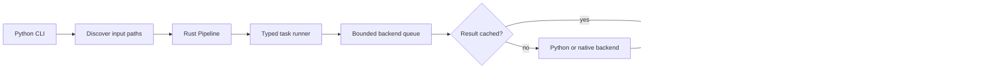

# How a processing command runs

The current CLI is a Python Typer application. It constructs backend objects and
a recipe, then runs a Rust `Pipeline` through the in-process PyO3 extension.
The pipeline owns file scheduling and task execution. There is no worker-process
protocol on this path.

## File and task scheduling

`--parallel` becomes `Pipeline(workers=N)`, default 8. The callback-driven CLI path
admits a bounded window of files, converts inputs within that window, and writes
outcomes as files finish. Rust task runners prepare typed requests, dispatch
backend work, and apply the returned result to pipeline state.

A registered backend has one bounded queue and one batcher, even when it serves
several task kinds. The batcher checks LMDB, gathers misses according to
`BatchPolicy`, calls the backend on a blocking thread, and returns results to
waiting runners. Different backends can overlap. A single backend batcher awaits
its current call before calling it again.

Morphotag has an additional per-file window of 128 pending utterances. Its Stanza
backend defaults to batches of at most 128 requests and a 100 ms collection
window. Stanza partitions a received batch by language configuration before model
inference. See [Performance](../user-guide/performance.md) for memory implications.

## Pipeline composition

Recipes in `python/batchalign/recipes.py` define task order. For example,
`morphotag` is one morphology task; `align` composes optional timing recovery and
forced alignment. Transcription composes ASR, an optional utterance segmenter,
and an optional speaker stage. The CLI chooses the backends supplied to recipes.
It does not automatically append alignment or morphology to transcription.

## Ownership

| Concern | Implementation |
|---|---|
| CLI arguments, input discovery, output paths | `python/batchalign/cli/` |
| Recipes and backend constructors | `python/batchalign/recipes.py`, `backends/` |
| File admission, outcomes, cancellation | `crates/batchalign/batchalign-engine/src/pipeline.rs` |
| Routing and batching | Engine `engine.rs`, `batcher.rs` |
| Result cache | Engine `cache.rs` |
| Typed requests and task runners | `crates/batchalign/batchalign-core/src/proto/`, `taskrunners/` |
| CHAT model, parsing, transformations | TalkBank Rust crates used by the core |

The GUI runs through the separate [HTTP service](server-architecture.md), which
constructs pipelines using the same recipe layer. It is not an implicit CLI daemon.
