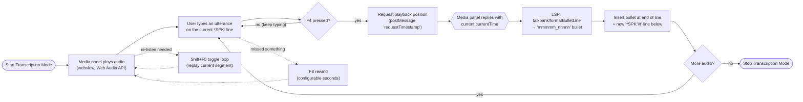

# Transcription from Audio

**Status:** Current
**Last updated:** 2026-04-16 16:55 EDT

This chapter describes the end-to-end workflow for creating a new CHAT transcript from an audio recording using the extension's Transcription Mode.

## Overview

Transcription Mode turns VS Code into a transcription workstation. Audio plays from a media panel while you type the transcript. At each utterance boundary, press `F4` to stamp a timing bullet that records the start and end time. The result is a properly timestamped CHAT file ready for annotation.

## Pipeline

Each `F4` keystroke triggers a fixed sequence across the three layers
(editor, media panel webview, LSP):


<!-- Verified against: apps/vscode-extension/src/commands/transcription.ts, apps/vscode-extension/src/mediaPanel.ts, crates/chatter-lsp/src/backend/execute_commands.rs (FormatBulletLine variant) -->

Dashed edges show the two sideways playback controls (`F8`, `Shift+F5`)
that don't advance the editor cursor. The `F4` path is the only one
that mutates the document.

## Prerequisites

- An audio or video file (MP3, WAV, M4A, MP4, OGG)
- A `.cha` file with at least a minimal CHAT header including an `@Media:` reference to the audio file

If you are starting from scratch, create a new `.cha` file with this template (available via the `chatheader` snippet):

```text
@UTF8
@Begin
@Languages:	eng
@Participants:	CHI Target_Child
@ID:	eng|corpus|CHI|||||Target_Child|||
@Media:	recording, audio
*CHI:
@End
```

Place the audio file (e.g., `recording.mp3`) in the same directory as the `.cha` file.

## Step-by-Step Workflow

### 1. Open the CHAT file

Open the `.cha` file in VS Code. The extension activates automatically.

### 2. Start Transcription Mode

Open the Command Palette (`Cmd+Shift+P` / `Ctrl+Shift+P`) and select **TalkBank: Start Transcription Mode**.

The extension opens a media panel and begins playing the audio from the start. The cursor is positioned on the first utterance line.

### 3. Type the utterance

Listen to the audio and type what the speaker says on the current `*SPEAKER:` line. Follow standard CHAT conventions for the transcription.

### 4. Stamp the timing bullet

When you reach an utterance boundary, press `F4` to stamp a timing bullet. The extension:

1. Requests the current playback position from the media panel
2. Delegates bullet formatting to the LSP via `talkbank/formatBulletLine`
3. Inserts a timing bullet at the end of the current line (e.g., `15320_18450`)
4. Creates a new `*SPEAKER:` line below with the configured default speaker code
5. Positions the cursor on the new line, ready for the next utterance

### 5. Use playback controls as needed

| Key | Action |
|-----|--------|
| `F4` | Stamp timestamp bullet and advance to new line |
| `F8` | Rewind by the configured number of seconds (default: 2) |
| `Shift+F5` | Toggle segment loop (replay the current segment) |

If you missed something, press `F8` to rewind and re-listen. The rewind amount is configurable via `talkbank.transcription.rewindSeconds`.

### 6. Stop Transcription Mode

When you are finished, open the Command Palette and select **TalkBank: Stop Transcription Mode**. This stops playback and deactivates the transcription keybindings.

## Configuration

| Setting | Default | Description |
|---------|---------|-------------|
| `talkbank.transcription.defaultSpeaker` | `CHI` | Speaker code inserted on new utterance lines |
| `talkbank.transcription.rewindSeconds` | `2` | Seconds to rewind when pressing F8 |

## Foot-Pedal and Custom Keybindings

Many transcribers use a USB foot pedal to control playback hands-free. To remap the transcription keys:

1. Open the Command Palette and select **TalkBank: Configure Transcription Keybindings**
2. The VS Code keybindings editor opens, pre-filtered to TalkBank transcription commands
3. Click the pencil icon next to any command to assign a new keybinding (e.g., map your foot pedal's key codes to stamp, rewind, and loop)

This is the recommended way to set up foot-pedal controls.

## Tips for Efficient Transcription

- **Listen before typing.** Play each segment fully before starting to type. This produces more accurate transcriptions than trying to type in real time.

- **Use rewind liberally.** `F8` rewinds by 2 seconds (configurable). Use it whenever you are unsure about a word.

- **Transcribe in passes.** On the first pass, capture the main content. On subsequent passes, add dependent tiers, fix unclear segments, and add annotations.

- **Save frequently.** Use `Cmd+S` regularly. Transcription is time-consuming work and you do not want to lose progress.

- **Check validation as you go.** The extension validates in real-time. Glance at the Problems panel periodically to catch formatting errors early rather than fixing them all at the end.

## After Transcription

Once you have a complete transcript with timing bullets, the next steps typically include:

1. **Add dependent tiers** -- run `batchalign morphotag` to add `%mor` and `%gra` tiers automatically
2. **Validate** -- use the [Validation Explorer](corpus-validation.md) to check for formatting errors
3. **Review** -- if you used automatic alignment, enter [Review Mode](../review/overview.md) to verify timing accuracy

## Related Chapters

- [Media Resolution](../media/resolution.md) -- how the extension finds media files
- [Transcription Mode](../media/transcription.md) -- detailed reference for transcription mode features
- [Keyboard Shortcuts](../configuration/keyboard-shortcuts.md) -- full keybinding reference
- [Settings Reference](../configuration/settings.md) -- transcription-related settings
